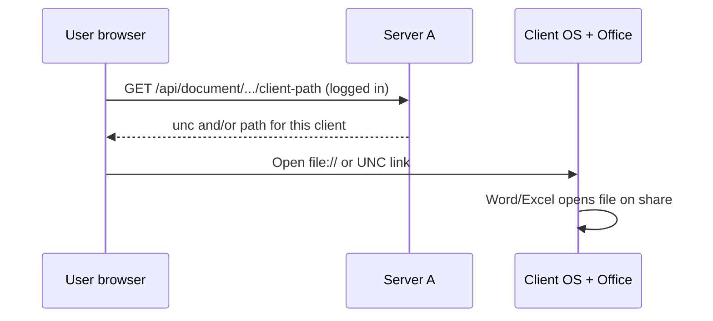

# Opening documents (browser, no install)

## Architecture

- **Server A** hosts the web app (e.g. Ubuntu + Docker). Users open the site from **other PCs** in a normal browser.
- **No download or companion** is required on client machines.
- Each client already has access to the **same document share** (SMB / mount). On **Öffnen**, the browser asks Server A for the path that PC should use (`\\server\share\...` or `/mnt/autodoc/...`) and triggers the OS to open it locally.



| Machine | Role |
|---------|------|
| **Server A** | Search, PDF preview, map container paths → client UNC/mount paths |
| **Client PC** | Browser + existing share access + Office; opens files locally |

PDFs can still use **PDF Vorschau** in the browser (streamed from Server A).

API details: [open-tokens-api.md](open-tokens-api.md). Setup: [setup.md](../setup.md) step 6.

---

## Server A configuration

Mount AutoDoc read-only into the container (see [platforms/ubuntu.md](../platforms/ubuntu.md)).

```bash
AUTODOC_MOUNT_PATH=/mnt/docbridge_share/AutoDoc
OPEN_LOCAL_ROOT=/mnt/autodoc
OPEN_BROWSER_CLIENT_PATH=true
OPEN_COMPANION_ENABLED=false
OPEN_ALLOW_SERVER_SIDE_STARTFILE=false
```

| Variable | Purpose |
|----------|---------|
| `OPEN_UNC_ROOT` | Root UNC **Windows clients** use, e.g. `\\fileserver\AutoDocShare` |
| `OPEN_CLIENT_LOCAL_ROOT` | Root path **Linux clients** use, e.g. `/mnt/autodoc` |
| `OPEN_LOCAL_ROOT` | Path inside the container (`/mnt/autodoc`) — used to map files |

Set both UNC and client-local roots if you have mixed Windows and Linux desktops.

Example — same file `Akte4711/Brief.docx`:

| Where | Path |
|-------|------|
| Server A container | `/mnt/autodoc/Akte4711/Brief.docx` |
| Windows client | `\\fileserver\AutoDocShare\Akte4711\Brief.docx` |
| Linux client | `/mnt/autodoc/Akte4711/Brief.docx` |

---

## Client PC requirements (no Knovas install)

1. User can open the file outside the browser (e.g. Explorer → `\\fileserver\...`, or `xdg-open /mnt/autodoc/...`).
2. Default app for the file type is installed (Office, etc.).
3. **Browser / OS policy** must allow opening `file:` or UNC links from your HTTPS site. Many offices already allow this on the intranet; if **Öffnen** does nothing, see [troubleshooting.md](troubleshooting.md).

Nothing is installed from Knovas on the client — only standard browser + share access.

---

## Optional: Open Companion

If browser launch is blocked by policy, set `OPEN_COMPANION_ENABLED=true` and deploy the Knovas Open Companion (Windows: `components/semantix_open_companion/`, Linux: `components/knovas_open_companion/linux/`). That is a fallback, not the default.

---

## Large corpora (slow SMB / millions of files)

For tenants with very large AutoDoc shares, reduce per-search SMB load:

```yaml
web:
  search:
    verify_files_on_disk: false   # skip os.stat on every hit; open still checks on demand
    enrichment_max_bytes: 52428800
    supplement_max_enrichment_scan: 5000
autodoc:
  max_discovery_entries: 10000
```

When `verify_files_on_disk` is false, search results set `can_open` from path mapping only; **Öffnen** and companion mint still verify the file exists once at open time.

## Search-only

`OPEN_BROWSER_CLIENT_PATH=false` and `OPEN_COMPANION_ENABLED=false` — no **Öffnen** button for local files; PDF preview may still work on Server A.

## Issues

[troubleshooting.md](troubleshooting.md)
