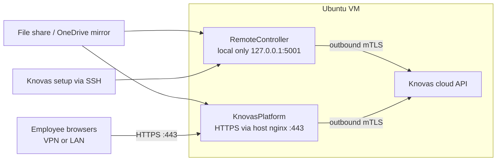

# Server Hoster Requirements

What your IT team or hosting partner must provision before Knovas installs **RemoteController** (document sync) and **KnovasPlatform** (search UI) on a customer VM.

Based on pilot deployment patterns and [deployment specifications](specifications.md).

---

## At a glance

| Hosting partner provides | Knovas / customer provides |
|--------------------------|----------------------------|
| Ubuntu VM, Docker, firewall rules | Tenant mTLS certificates |
| Internal DNS or hosts entries | Knovas API URLs (tenant) |
| HTTPS on port 443 (Platform) | Pilot folder path on the share |
| Trusted TLS certificate for `knovas.<company>.ch` (if not already available) | — |
| SSH access for Knovas setup | Read-only share credentials |
| Document share reachable from the VM | UI login secrets (`WEB_SECRET_KEY`, etc.) |
| Outbound HTTPS to Knovas cloud | Which directory to index for the pilot |

---

## What runs on the VM

Both components run on the **same Ubuntu server** as Docker stacks:

- **RemoteController** — syncs documents to Knovas. Operates on `127.0.0.1:5001` only (local control via SSH). No inbound network access to RC is required.
- **KnovasPlatform** — search web app for employees. Published on **HTTPS port 443** via host NGINX.

---

## Minimum hardware

Sizing covers **both** RemoteController and KnovasPlatform on one VM. Document files stay on the network share (or OneDrive mirror path)—not on the OS disk.

| Employees (N) | vCPU | RAM | OS disk | Notes |
|---------------|------|-----|---------|-------|
| Up to 25 | 4 | 8 GB | 30 GB | Pilot / small team |
| 26–50 | 6 | 12 GB | 40 GB | More concurrent search users |
| 51–100 | 8 | 16 GB | 50 GB | Heavy concurrent search |
| Large SMB corpus or OneDrive mirror | +2–4 GB RAM | — | +10 GB if local mirror | Slow CIFS or local mirror storage |

The OS disk holds Ubuntu, Docker images, RC sync state, and Platform logs/data only.

---

## Operating system and software

| Item | Requirement |
|------|-------------|
| OS | **Ubuntu 24.04 LTS** (VM is a Docker host) |
| Container runtime | Docker Engine + Compose v2 |
| Reverse proxy | Host NGINX for Platform TLS (production) |
| Time sync | NTP enabled (required for mTLS) |
| Remote admin | SSH server for Knovas setup access |

---

## Network and firewall

### Inbound (to the VM)

| Port | Purpose | Source |
|------|---------|--------|
| `443/tcp` | KnovasPlatform (HTTPS) | Customer LAN and/or VPN only |
| `22/tcp` | SSH (Knovas setup) | VPN; agreed support IPs if needed |

**Access policy:** Platform serves sensitive document metadata. Restrict access to the **company network or VPN**. **HTTPS is mandatory** for production—HTTP is not acceptable for go-live.

### Not required

- Public IP or public DNS for the Platform (internal DNS or hosts file on workstations is acceptable)
- Inbound access to RemoteController API (`5001`) from the network
- Inbound access to Platform port `8081` from other hosts (loopback + host NGINX only)

### Outbound (from the VM)

| Target | Required when |
|--------|---------------|
| Knovas tenant API (HTTPS, typically `:8443`, mTLS) | Always — document sync and search |
| `login.microsoftonline.com` and Microsoft Graph | OneDrive / SharePoint mirror only |

---

## DNS and HTTPS

| Item | Requirement |
|------|-------------|
| FQDN pattern | `knovas.<company>.ch` (e.g. `knovas.abt.ch`) |
| User port | **443** only — employees do not connect to `8081` |
| TLS | Valid certificate trusted on employee PCs (internal CA or public CA) |
| Certificate ownership | **Hosting partner** issues or provisions the Platform TLS certificate and key for the FQDN above, unless the customer already has one. Employee browsers must trust it without warnings (deploy internal CA to workstations, or use a public CA). Knovas tenant mTLS certs are separate — see [certificates.md](certificates.md). |
| Internal-only DNS | Private DNS **or** hosts file on RDS/workstations mapping FQDN → internal IP |
| VPN users | May need the same hosts entry if public DNS is not used |
| Knovas support on VPN | May need hosts entry or internal IP for testing when public DNS is removed |

---

## Document sources

### Option A — SMB / NFS file share (typical pilot)

| Item | Requirement |
|------|-------------|
| Access level | **Read-only** on customer documents |
| Reachability | Share must be reachable **from the Ubuntu VM** (not only from VPN clients) |
| UNC example | `\\<fileserver>\<share>\<folder>` with a dedicated service account |
| Pilot scope | Customer confirms which folder is indexed for the pilot |
| Employee PCs | Same share mounted for **Open document** in the browser (UNC or Linux mount path) |

### Option B — OneDrive / SharePoint (optional)

| Item | Requirement |
|------|-------------|
| Microsoft Entra app | Tenant ID, client ID, client secret |
| Library scope | Drive/site ID and read access to the target library |
| VM storage | Local mirror path on the VM for sync (add RAM/disk per sizing table) |
| Web links | Optional JSONL enrichment for “Open in OneDrive/SharePoint” in search results |

### End-user PCs (not the VM)

- Document share mounted at the path employees use (Windows UNC or Linux mount)
- Browser: Microsoft Edge or Google Chrome on Windows; Firefox or Chromium on Linux

---

## Admin access for Knovas setup

- SSH to the Ubuntu VM from VPN (credentials via secure channel)
- VM can mount and read the document share with the read-only account
- Optional: temporary broader access for go-live testing, then restrict to LAN/VPN only

---

## Handover checklist

Hosting partner signs off before Knovas installs:

- [ ] VM spec meets the row for **N** employees in the sizing table
- [ ] Ubuntu 24.04 LTS, Docker, NTP
- [ ] SSH from VPN works
- [ ] VM → file share read-only works
- [ ] Outbound HTTPS to Knovas API allowed
- [ ] Internal DNS or hosts entries for `knovas.<company>.ch`
- [ ] Platform TLS certificate for the FQDN issued (or existing cert confirmed); trusted on employee PCs
- [ ] HTTPS on 443; HTTP not used for production
- [ ] 443 allowed from employee subnets/VPN only
- [ ] Pilot folder path and read-only credentials delivered securely
- [ ] (If OneDrive/SharePoint) Graph credentials and library scope agreed

---

## Further reading

| Document | Use |
|----------|-----|
| [specifications.md](specifications.md) | Full technical deployment specs |
| [certificates.md](certificates.md) | mTLS certificate layout |
| [RemoteController/docs/local-setup.md](../RemoteController/docs/local-setup.md) | RC local-only install |
| [KnovasPlatform/docs/deployment/host-nginx-internal.md](../KnovasPlatform/docs/deployment/host-nginx-internal.md) | Platform HTTPS |

**Support:** support@knovas.ch
