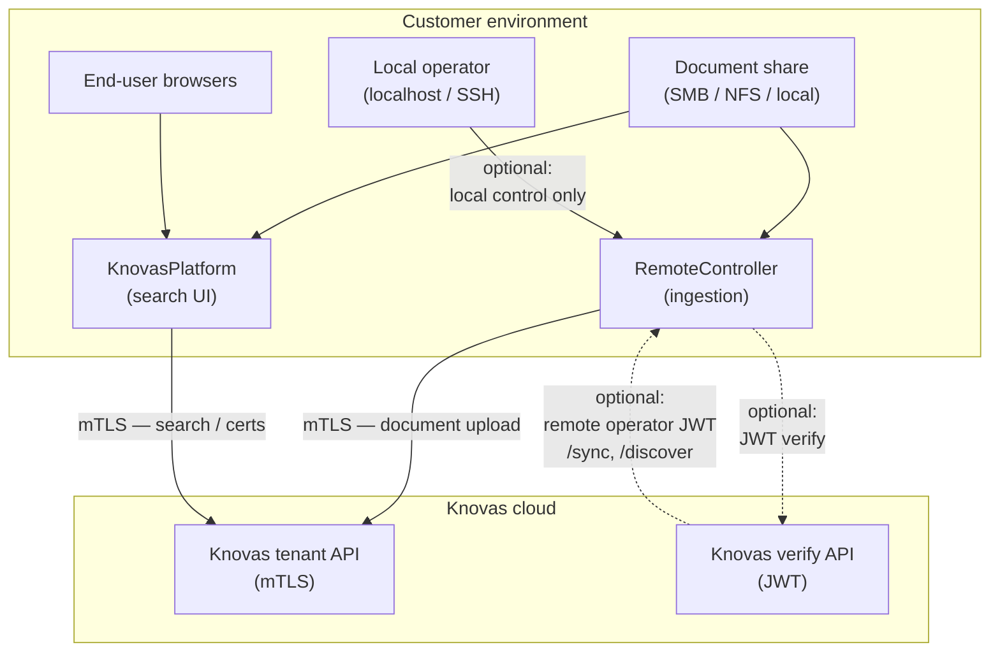

# Knovas Components — Deployment Specifications


|                      |                                                                                   |
| -------------------- | --------------------------------------------------------------------------------- |
| **Document version** | 1.0                                                                               |
| **Last updated**     | July 2026                                                                         |
| **Audience**         | Customer IT / operations teams deploying and operating Knovas-hosted components   |
| **Scope**            | RemoteController and KnovasPlatform as delivered in the Knovas Components package |


---

## Overview

This document describes the runtime, network, credential, and storage requirements for the two customer-hosted components:

- **RemoteController** — discovers local documents, converts them for indexing, and ingests them into your Knovas tenant.
- **KnovasPlatform** — provides the search web application for the same tenant.

Both components are normally deployed together: RemoteController first (ingestion), then KnovasPlatform (search). They may also run on separate hosts.

Neither component is intended for direct exposure to the public internet.

**RemoteController** supports two control models:

- **Remote operator access** — Knovas or your operators reach RC over HTTPS (private link or VPN) using JWT-protected routes. Requires the NGINX edge, `RC_INSTANCE_TOKEN`, and employee JWTs.
- **Local-only control** — RC is bound to `127.0.0.1:5001` on the host. Operators run `/discover`, `/sync`, and other control routes from the same machine (or via SSH) without exposing RC to the network and without `RC_INSTANCE_TOKEN` or employee JWTs. Document ingestion still uses outbound mTLS to the Knovas tenant API when you sync.

**KnovasPlatform** is designed for intranet, VPN, or single-workstation use.

### Architecture




### Responsibilities


| Item                                             | Provided by Knovas | Provided by customer                 |
| ------------------------------------------------ | ------------------ | ------------------------------------ |
| Tenant mTLS certificate, key, and CA             | Yes                | Install on each host                 |
| `RC_CLIENT_ID`                                     | Yes                | Configure in RemoteController `.env` |
| `RC_INSTANCE_TOKEN`                                | Yes (remote-operator mode only) | Configure in RemoteController `.env` |
| Knovas API base URLs                             | Yes (per tenant)   | Configure egress firewall rules      |
| `WEB_SECRET_KEY`, `COMPANY_LOGIN_*`              | —                  | Choose locally for KnovasPlatform    |
| Docker host(s), document share, internal DNS/TLS | —                  | Yes                                  |
| Edge TLS certificate for RemoteController NGINX  | —                  | Yes, if using remote-operator mode (or internal CA) |
| Employee JWT for RC operator routes              | Issued by Knovas (remote-operator mode only) | Used by operators, or not required in local-only mode |


**Support:** For tenant provisioning, certificate issues, and API connectivity, contact support@knovas.ch.

---

## 1. RemoteController

Customer-hosted Flask service that walks watched directories, converts documents to Markdown, and pushes them to the Knovas ingestion API over mTLS.

### 1.1 Runtime


| Item                       | Value                                                                              |
| -------------------------- | ---------------------------------------------------------------------------------- |
| Language                   | Python                                                                             |
| Minimum Python             | `>=3.11,<4`                                                                        |
| Production image base      | `python:3.12-slim`                                                                 |
| WSGI server                | Gunicorn, **single worker** (in-process scheduler holds locks)                     |
| Web framework              | Flask 3.x                                                                          |
| Reverse proxy (production) | NGINX 1.27 (TLS termination)                                                       |
| Container runtime          | Docker Engine + Compose v2                                                         |
| Host OS                    | Linux (primary). Windows / macOS supported via Docker Desktop for evaluation only. |


### 1.2 Runtime dependencies

Key Python packages (pinned ranges in `RemoteController/pyproject.toml`):

- `flask`, `gunicorn`, `requests`, `cryptography`, `jsonschema`, `prometheus-client`
- `python-docx` — `.docx` parsing
- `pymupdf` — PDF text extraction
- `extract-msg` — Outlook `.msg` email parsing

### 1.3 Supported source formats

`.md`, `.txt` (UTF-8), `.docx`, `.pdf`, `.eml`, `.msg`.

Binary formats are converted to Markdown for indexing. The original path is preserved as the document identifier so KnovasPlatform can open or download the source file.

### 1.4 Network

RemoteController has two inbound models. Outbound access to the Knovas tenant API is required whenever you ingest documents.


| Direction | Port / target | Remote-operator mode | Local-only control mode |
| --------- | ------------- | -------------------- | ----------------------- |
| Inbound HTTP (container) | `5001/tcp` | Behind NGINX edge; not exposed publicly | Bound to `127.0.0.1:5001` only — reachable from the host (or SSH session), not from the LAN |
| Inbound HTTPS (edge) | `443/tcp` | NGINX TLS termination, proxies to port 5001 | Not used — edge disabled |
| Outbound to Knovas verify API | `${KNOVAS_INTERNAL_API_URL}` | Operator JWT validation (URL provided by Knovas) | Not used — local auth bypass skips JWT verify on control routes |
| Outbound to Knovas ingestion | `${SEMANTIX_SECURE_BASE_URL}` | Tenant mTLS; document upload | Same — tenant mTLS; document upload |

**Remote-operator mode:** Do not expose port `5001` publicly. Front the application with the NGINX edge on port 443. Operators or Knovas reach RC over a private link or VPN.

**Local-only control mode:** Use the `docker-compose.internal.yml` overlay. RC listens on `127.0.0.1:5001` only. No inbound connections from other hosts are required or accepted. An operator on the same machine (or connected via SSH) calls `/discover`, `/sync`, and `/sync/status` directly — no `RC_INSTANCE_TOKEN` or employee JWT. Outbound mTLS to the Knovas ingestion API is still used when syncing documents.

See `RemoteController/docs/network-and-firewall.md` for the full ingress/egress matrix.

### 1.5 Credentials & certificates

**Tenant mTLS** (outbound calls to the Knovas ingestion API):


| Variable                    | Purpose                                  |
| --------------------------- | ---------------------------------------- |
| `SEMANTIX_CLIENT_CERT_PATH` | PEM client certificate                   |
| `SEMANTIX_CLIENT_KEY_PATH`  | PEM private key (encrypted or plaintext) |
| `SEMANTIX_CA_CERT_PATH`     | CA root for verifying the Knovas API     |


Certificates are mounted read-only into the container (default host path: `certs/` adjacent to the RemoteController directory). File permissions must be **0600**, owner `rcuser` (uid 10001). Use `RemoteController/scripts/install_tenant_certs.sh` to install and verify permissions.

> **Note:** Environment variables prefixed with `SEMANTIX_` are the configured names for the Knovas secured API.

**RemoteController instance / operator auth** (inbound control routes such as `/discover` and `/sync`):

| Item | Remote-operator mode | Local-only control mode |
| ---- | -------------------- | ----------------------- |
| `RC_INSTANCE_TOKEN` | Required — authenticates this RC instance to the Knovas verify endpoint | Not required |
| Employee JWT | Required as `Authorization: Bearer <token>` | Not required |
| `RC_INTERNAL_LOCAL_BYPASS=true` | Must be absent or `false` | Set automatically by `docker-compose.internal.yml` |

Local-only control is suitable for single-server deployments where an administrator operates RC from the host itself. Do not enable `RC_INTERNAL_LOCAL_BYPASS` on a shared server that accepts network connections.


**Public edge TLS** (NGINX): certificate and key under `certs/edge/`, mounted by Docker Compose.

### 1.6 Environment variables

Copy `RemoteController/.env.example` to `.env`. Required unless noted:

**Required (all modes)**

- `RC_CLIENT_ID`
- `RC_WATCH_ROOTS` — comma-separated absolute container paths to watched directories
- `SEMANTIX_SECURE_BASE_URL`
- `SEMANTIX_CLIENT_CERT_PATH`, `SEMANTIX_CLIENT_KEY_PATH`, `SEMANTIX_CA_CERT_PATH`

**Required (remote-operator mode only)**

- `KNOVAS_INTERNAL_API_URL`
- `RC_INSTANCE_TOKEN`

**Required (local-only control mode)**

- `KNOVAS_INTERNAL_API_URL` and `RC_INSTANCE_TOKEN` are not required when using `docker-compose.internal.yml` (sets `RC_INTERNAL_LOCAL_BYPASS=true`)

**API**

- `RC_API_PORT` (default `5001`)

**API rate limiting**

- `RC_RATE_LIMIT_ENABLED`, `RC_RATE_LIMIT_IP_MAX_TOKENS`, `RC_RATE_LIMIT_IP_REFILL_PER_SEC`, and related variables (see `.env.example`)

**Scheduler**

- `RC_SYNC_CONFIG_PATH` (default `config/remote_controller_sync.json`)
- `RC_SYNC_DEFAULT_WINDOW_START`, `RC_SYNC_DEFAULT_WINDOW_END`
- `RC_SYNC_DEFAULT_MAX_INGESTION_REQUESTS_PER_MINUTE`
- `RC_SYNC_DEFAULT_SCAN_INTERVAL_SECONDS`

**Optional OneDrive mirror**

- `ONEDRIVE_DRIVE_ID`, `ONEDRIVE_TENANT_ID`, `ONEDRIVE_CLIENT_ID`, `ONEDRIVE_CLIENT_SECRET`

**Local-only control mode** (set by `docker-compose.internal.yml`; do not enable on network-reachable hosts)

- `RC_INTERNAL_LOCAL_BYPASS`, `RC_DISCOVER_LOCAL_BYPASS`

**Development / testing only** (must be absent or `false` in production)

- `RC_SKIP_CONFIG_VALIDATION`

Full reference: `RemoteController/docs/configuration.md`.

### 1.7 Storage


| Mount                    | Container path  | Mode       | Purpose                                      |
| ------------------------ | --------------- | ---------- | -------------------------------------------- |
| `certs/` (host)          | `/certs`        | read-only  | Tenant mTLS + edge certificates              |
| Document data (host)     | `/data`         | read-only  | Watched documents                            |
| Named volume `rc-config` | `/app/config`   | read-write | Scheduler configuration (mode 0600 expected) |
| Named volume `rc-state`  | `/var/rc-state` | read-write | Sync state database                          |


State is stored in SQLite (`.rc-sync-state.db`, v1 format). Scheduler configuration schema: `RemoteController/contracts/remote_controller_sync_config.schema.json`.

### 1.8 Hardware

**Recommended baseline**


| Resource | Minimum        | Notes                                                         |
| -------- | -------------- | ------------------------------------------------------------- |
| CPU      | 2 vCPU         | Single Gunicorn worker is mandatory                           |
| RAM      | 4 GB           | Increase for large corpora or slow network mounts             |
| Disk     | 10 GB + corpus | State DB and logs; corpus size depends on your document store |


**Operational notes**

- A single Gunicorn worker is required — the scheduler holds locks in-process.
- For very large corpora (hundreds of GB), tune `sequential_subfolders`, `max_files_per_cycle`, and `max_scan_entries_per_cycle` in the scheduler config, especially on SMB/CIFS mounts. See `RemoteController/docs/operations.md`.

### 1.9 Health & observability


| Endpoint           | Auth                  | Description                                                                                                                                                                 |
| ------------------ | --------------------- | --------------------------------------------------------------------------------------------------------------------------------------------------------------------------- |
| `GET /health`      | None                  | **200** with `{"status":"ok", ...}` when healthy; **503** with `"status":"degraded"` if configuration is invalid, watch roots are unreadable, or the scheduler is unhealthy |
| `GET /metrics`     | None                  | Prometheus metrics — restrict at the edge if required                                                                                                                       |
| `GET /sync/status` | JWT (or local bypass) | Sync status; supports `?live=1` and `?live=1&deep_scan=1`                                                                                                                   |


Logs: structured JSON (no secrets, file basenames only) via `docker compose logs -f remote-controller`.

### 1.10 Deployment topologies

Defined by Docker Compose overlays in the RemoteController directory:


| Topology | Compose files | Control model | Description |
| -------- | ------------- | ------------- | ----------- |
| **Remote operator (default)** | `docker-compose.yml` | Remote-operator | Application + NGINX edge on an internal bridge network; JWT-protected operator routes |
| **Local-only control** | `docker-compose.yml` + `docker-compose.internal.yml` | Local-only | Application bound to `127.0.0.1:5001`, edge disabled; operator controls RC from the host without inbound network access |
| **Bulk corpus (evaluation)** | `+ docker-compose.corpus.yml` | Either | Additional read-only corpus mount for testing |

**Start (local-only control):**

```bash
docker compose -f docker-compose.yml -f docker-compose.internal.yml up -d --build
```

Then operate RC from the host, e.g. `curl http://127.0.0.1:5001/health`, `GET /discover`, `POST /sync`.

Remote-operator setup guide: `RemoteController/docs/SETUP.md`. Local-only guide: `RemoteController/docs/local-setup.md`.

---

## 2. KnovasPlatform

Customer-hosted Flask search application with a bundled web frontend, Knovas API client, and optional document-open support. Intended for HTTPS deployment behind a host-level NGINX reverse proxy on an internal network.

### 2.1 Runtime


| Item                       | Value                                                                      |
| -------------------------- | -------------------------------------------------------------------------- |
| Language                   | Python                                                                     |
| Minimum Python             | `>=3.11`                                                                   |
| Image base                 | `python:3.11-slim`                                                         |
| Web framework              | Flask 3.0                                                                  |
| WSGI server                | Gunicorn (default **2 workers × 4 threads**, 120 s timeout — configurable) |
| Frontend                   | Bundled into the image (no separate Node.js runtime at deploy time)        |
| Reverse proxy (in-compose) | NGINX Alpine                                                               |
| Container runtime          | Docker Engine + Compose v2                                                 |
| Host OS                    | Linux (Ubuntu, Debian) primary; Windows via Docker Desktop for evaluation  |


### 2.2 Services (Docker Compose)


| Service               | Role                         | Published port                          |
| --------------------- | ---------------------------- | --------------------------------------- |
| `docbridge-web`       | Flask application + Gunicorn | Internal only (`5000`)                  |
| `docbridge-web-nginx` | In-compose reverse proxy     | `${DOCBRIDGE_WEB_PORT:-8081}`           |
| `semantix-mock`       | Offline demo API             | Internal only — **profile `mock` only** |


> Docker service names retain legacy `docbridge` identifiers; they refer to the KnovasPlatform application.

The `docker-compose.host-nginx.yml` overlay rebinds the web proxy to `127.0.0.1:8081` for production host-NGINX deployment (see §2.7).

### 2.3 Network

KnovasPlatform runs on **internal networks only**. Listening ports must not be reachable from the public internet.


| Surface                          | Address                                 | Notes                                                    |
| -------------------------------- | --------------------------------------- | -------------------------------------------------------- |
| Web UI (localhost-only)          | `127.0.0.1:${DOCBRIDGE_WEB_PORT:-8081}` | Host-NGINX overlay; not bound to non-loopback interfaces |
| Web UI (trusted-LAN HTTP)        | `0.0.0.0:${DOCBRIDGE_WEB_PORT:-8081}`   | Plain HTTP — evaluation or trusted LAN only              |
| Host HTTPS (production intranet) | `0.0.0.0:443` on host NGINX             | Internal DNS; TLS terminated on the host                 |
| Outbound to Knovas API           | `${SEMANTIX_API_URL}`                   | mTLS — the only mandatory egress                         |


The application port (`5000`) is Docker-internal only. Port `8081` is the sole published application port; in production mode it is bound to loopback.

Knovas API endpoints used (configurable base URL): `/secured/query`, `/secured/health`, `/api/search`, `/secured/init_document_transmission`, `/secured/transmit_document_part`, `/secured/generate_certificate`.

### 2.4 mTLS & credentials

Certificate files under `${SEMANTIX_CERTS_DIR:-./certs}` are mounted read-only to `/app/certs`:


| File         | Environment variable   | Default container path  |
| ------------ | ---------------------- | ----------------------- |
| `client.crt` | `SEMANTIX_CLIENT_CERT` | `/app/certs/client.crt` |
| `client.key` | `SEMANTIX_CLIENT_KEY`  | `/app/certs/client.key` |
| `ca.crt`     | `SEMANTIX_CA_CERT`     | `/app/certs/ca.crt`     |


- mTLS enabled by default: `SEMANTIX_USE_SECURED_API=true`
- Automatic certificate renewal: checks every 3600 s, renews when fewer than 30 days remain
- Optional: `SEMANTIX_CUSTOMER_ID`, `SEMANTIX_ENCRYPTION_MATRIX_PATH`

### 2.5 Environment variables

Copy `KnovasPlatform/.env.example` to `.env`.

**Required**

- `WEB_SECRET_KEY` — Flask session signing (generate with `openssl rand -hex 32`)
- `COMPANY_LOGIN_NAME`, `COMPANY_LOGIN_PASSWORD` — UI login (single shared credential)
- `SEMANTIX_API_URL`
- `SEMANTIX_CLIENT_CERT`, `SEMANTIX_CLIENT_KEY`, `SEMANTIX_CA_CERT` (defaults provided; certificate files must exist)

**Common**

- `DOCBRIDGE_WEB_PORT` (default `8081`)
- `DOCBRIDGE_WEB_WORKERS`, `DOCBRIDGE_WEB_THREADS`, `DOCBRIDGE_WEB_TIMEOUT` (defaults 2, 4, 120)
- `SEMANTIX_USE_SECURED_API` (default `true`)
- `AUTODOC_MOUNT_PATH` (host path) → mounted to `/mnt/autodoc` (read-only)
- `OPEN_PUBLIC_BASE_URL` — public HTTPS base URL (required for production host-NGINX; e.g. `https://knovas.example.internal`)
- `OPEN_LOCAL_ROOT` — document path inside the container (e.g. `/mnt/autodoc`); maps server paths to client paths
- `OPEN_UNC_ROOT` — how Windows clients see the share (e.g. `\\fileserver\AutoDocShare`)
- `OPEN_CLIENT_LOCAL_ROOT` — how Linux clients mount the share (e.g. `/mnt/autodoc`)
- `SEARCH_ENRICHMENT_PATH` (default `/mnt/autodoc/.search_enrichment.jsonl`) — optional OneDrive URL enrichment

**File-open companion (optional fallback)**

- `OPEN_COMPANION_ENABLED` (default `false`)
- `OPEN_BROWSER_CLIENT_PATH` (default `true`)

### 2.6 Storage


| Mount                                     | Container path | Mode       | Purpose                                         |
| ----------------------------------------- | -------------- | ---------- | ----------------------------------------------- |
| Application config (host)                 | `/app/config`  | read-only  | Flask configuration                             |
| `${SEMANTIX_CERTS_DIR:-./certs}`          | `/app/certs`   | read-only  | mTLS certificates                               |
| `${AUTODOC_MOUNT_PATH}`                   | `/mnt/autodoc` | read-only  | Source documents (path resolution + enrichment) |
| Named volume `docbridge_integration_data` | `/app/data`    | read-write | Application data                                |
| Named volume `docbridge_integration_logs` | `/app/logs`    | read-write | Application logs                                |


### 2.7 Deployment topologies

All modes assume an internal (intranet / VPN / virtual network) environment. There is no internet-facing topology.

**A. Direct HTTP — evaluation / trusted LAN**

- Web UI at `http://<host>:8081` on all interfaces
- No TLS — acceptable for short-lived demos or a trusted LAN only
- **Not for production**

Start: `start_stack.sh` or `start_stack.ps1`. Guide: `KnovasPlatform/docs/setup.md`.

**B. Internal HTTPS via host NGINX — production intranet**

- Docker binds the web UI to `127.0.0.1:8081` only — not reachable from the network
- Host NGINX listens on `0.0.0.0:443`, terminates TLS, proxies to `127.0.0.1:8081`
- Internal DNS resolves the FQDN; server certificate issued by your internal CA
- End users connect on port **443** only — they do not connect to port 8081 on the network
- Firewall: allow **443** from client subnets; do not expose **8081** to other hosts

Reference NGINX config: `KnovasPlatform/deploy/host-nginx/knovas-platform.conf.example`

Optional systemd unit: `KnovasPlatform/deploy/systemd/knovas-platform.service.example`

Start: `scripts/start_stack_host_nginx.sh`. Guide: `KnovasPlatform/docs/deployment/host-nginx-internal.md`.

**C. Localhost-only (single workstation)**

- Same Docker overlay as mode B, but without host NGINX
- User opens `http://127.0.0.1:8081` in a browser on the same machine
- No port published to the network; access may be via SSH tunnel, VPN, or RDP
- Only outbound traffic is mTLS to the Knovas API

---

### 2.8 End-user / browser requirements

The **Open** (*Öffnen*) feature opens documents from the browser without a client install by default:

- The end-user PC must have the document share mounted (SMB/UNC or Linux mount) at a path matching `OPEN_UNC_ROOT` (Windows) or `OPEN_CLIENT_LOCAL_ROOT` (Linux)
- The browser must be allowed by IT policy to follow `file:` / UNC links from an HTTPS origin
- The user must have the native application for the file type installed (Word, Excel, etc.)

If the browser cannot open `file:`/UNC links, deploy the optional open companion:


| Platform | Location                                                 |
| -------- | -------------------------------------------------------- |
| Windows  | `KnovasPlatform/components/semantix_open_companion/`     |
| Linux    | `KnovasPlatform/components/knovas_open_companion/linux/` |


Enable with `OPEN_COMPANION_ENABLED=true`. API endpoints: `GET /api/document/<doc_id>/client-path`, `POST /api/open-tokens/mint`, `POST /api/open-tokens/redeem`.

**Supported browsers:** Current versions of Microsoft Edge or Google Chrome on Windows; Firefox or Chromium on Linux. Safari is not formally tested.

Guide: `KnovasPlatform/docs/integration/opening-documents.md`.

### 2.9 Demo / mock mode

For evaluation without a Knovas tenant. **Not for production.**

In `.env`:

```env
SEMANTIX_API_URL=http://semantix-mock:5000
SEMANTIX_USE_SECURED_API=false
SEMANTIX_ALLOW_LEGACY_API_FALLBACK=true
```

Start with the `mock` profile:

```bash
docker compose --profile mock up -d --build
```

The mock API requires no tenant and no mTLS. Do not expose mock services on production networks.

Guide: `KnovasPlatform/docs/demo.md`.

### 2.10 Hardware

**Recommended baseline**


| Resource | Minimum      | Notes                                                      |
| -------- | ------------ | ---------------------------------------------------------- |
| CPU      | 2 vCPU       | Default 2 workers × 4 threads ≈ 8 concurrent request slots |
| RAM      | 4 GB         | Application + NGINX; increase under heavy concurrent use   |
| Disk     | 20 GB        | Logs and application data; corpus accessed via mount       |
| GPU      | Not required | —                                                          |


At idle, the stack typically uses ≤1 GB RAM.

---

## 3. Joint deployment requirements

These apply regardless of which component you deploy.

- **Tenant provisioning.** Both components require mTLS material issued by Knovas. RemoteController always needs `RC_CLIENT_ID`. `RC_INSTANCE_TOKEN` is required only in remote-operator mode. KnovasPlatform additionally needs locally chosen `WEB_SECRET_KEY` and `COMPANY_LOGIN_*` credentials.
- **Knovas API reachability.** Outbound HTTPS from each host to your tenant API URL is required for document ingestion and search. In remote-operator mode, RemoteController also needs the verify URL (`KNOVAS_INTERNAL_API_URL`). In local-only control mode, the verify URL is not used for operator routes. Confirm firewall rules using `RemoteController/docs/network-and-firewall.md`.
- **Docker + Compose v2** on each host. RemoteController may require merging compose overlays on the command line (`-f docker-compose.yml -f docker-compose.internal.yml`, etc.).
- **Time synchronization (NTP).** mTLS handshakes and JWT validation require accurate system clocks.
- **Certificate layout.** If components run on separate hosts, install an identical copy of the tenant certificate bundle on each host.
- **Document share consistency.** RemoteController watches originals for ingestion; KnovasPlatform resolves client paths based on how end-user PCs see the same share. Align `RC_WATCH_ROOTS`, `AUTODOC_MOUNT_PATH`, `OPEN_UNC_ROOT`, `OPEN_CLIENT_LOCAL_ROOT`, and `OPEN_LOCAL_ROOT`.
- **Network exposure.**
  - **RemoteController (remote-operator mode)** must accept inbound HTTPS from operators. The NGINX edge must be reachable over a private interconnect, VPN, or peering — not necessarily the public internet.
  - **RemoteController (local-only control mode)** does not accept inbound connections from the network. The API is available on `127.0.0.1:5001` only; operators control RC from the host. Outbound mTLS to the Knovas ingestion API is still required when syncing.
  - **KnovasPlatform** is intranet-only. In production (mode B) or localhost-only (mode C), no application port is exposed beyond loopback or internal HTTPS on port 443.
- **Logs and metrics.** Both components produce structured logs via `docker compose logs`. RemoteController additionally exposes Prometheus metrics at `/metrics`.

---

## 4. Go-live checklist

### RemoteController

Choose the checklist that matches your control model.

**Remote-operator mode**

- [ ] Tenant certificates installed with correct permissions (`install_tenant_certs.sh`)
- [ ] `.env` and `config/remote_controller_sync.json` completed
- [ ] Document share mounted read-only; `RC_WATCH_ROOTS` points to container paths
- [ ] NGINX edge TLS configured; port 5001 not publicly exposed
- [ ] `curl https://<rc-base>/health` returns **200** from outside the container
- [ ] Firewall rules per `network-and-firewall.md`
- [ ] Base URL and operator contacts registered with Knovas
- [ ] Operator JWT issued; `GET /discover` and `POST /sync` succeed during sync window
- [ ] Ingestion confirmed; `GET /sync/status` healthy

**Local-only control mode**

- [ ] Tenant certificates installed with correct permissions (`install_tenant_certs.sh`)
- [ ] `.env` and `config/remote_controller_sync.json` completed (`RC_INSTANCE_TOKEN` not required)
- [ ] Document share mounted read-only; `RC_WATCH_ROOTS` points to container paths
- [ ] Stack started with `docker compose -f docker-compose.yml -f docker-compose.internal.yml up -d --build`
- [ ] `curl http://127.0.0.1:5001/health` returns **200** from the host
- [ ] Port 5001 is not reachable from other hosts on the network
- [ ] `GET /discover` and `POST /sync` succeed from localhost (no JWT)
- [ ] Outbound mTLS to Knovas ingestion API works; ingestion confirmed via `GET /sync/status`

Full guides: `RemoteController/docs/onboarding-checklist.md` (remote-operator), `RemoteController/docs/local-setup.md` (local-only).

### KnovasPlatform (production intranet)

- [ ] Documents indexed in Knovas (RemoteController ingestion complete)
- [ ] mTLS files in `KnovasPlatform/certs/` (`client.crt`, `client.key`, `ca.crt`)
- [ ] Internal DNS: FQDN → server IP
- [ ] Internal TLS certificate issued and trusted on client PCs
- [ ] `.env` completed — strong secrets, `SEMANTIX_API_URL`, `OPEN_PUBLIC_BASE_URL`
- [ ] Stack started with `scripts/start_stack_host_nginx.sh`
- [ ] `curl http://127.0.0.1:8081/health` → ok
- [ ] Host NGINX configured; `curl https://<fqdn>/health` → ok
- [ ] Firewall: **443** from client subnets; **8081** not exposed externally
- [ ] Login, search, and document open verified from a client workstation

Full guide: `KnovasPlatform/docs/deployment/checklist-host-nginx.md`.

---

## 5. Operations & maintenance


| Task                 | RemoteController                                 | KnovasPlatform                                                           |
| -------------------- | ------------------------------------------------ | ------------------------------------------------------------------------ |
| View logs            | `docker compose logs -f remote-controller`       | `docker compose logs -f docbridge-web`                                   |
| Health check         | `GET /health`                                    | `GET /health` (via NGINX)                                                |
| Certificate renewal  | Manual reinstall or `install_tenant_certs.sh`    | Automatic (checks hourly; renews <30 days)                               |
| Application upgrade  | Rebuild image, `docker compose up -d --build`    | Rebuild image, `docker compose up -d --build`                            |
| Configuration change | Edit `.env` or scheduler JSON, restart container | Edit `.env`, recreate `docbridge-web`                                    |
| Backup               | Named volumes `rc-config`, `rc-state`            | Named volumes `docbridge_integration_data`, `docbridge_integration_logs` |


**Upgrade procedure (both components):** Pull the updated delivery package, review release notes, update `.env` if new variables were added, rebuild containers, verify `/health`, and run a smoke test (sync for RC; search for KP).

---

## 6. Troubleshooting (common issues)

### RemoteController


| Symptom                        | Likely cause / fix                                                                                         |
| ------------------------------ | ---------------------------------------------------------------------------------------------------------- |
| `/health` returns 503 degraded | Invalid `.env`, unreadable watch roots, or scheduler error — check `docker compose logs remote-controller` |
| Sync fails with auth error     | Expired or missing operator JWT; verify `RC_INSTANCE_TOKEN` and Knovas verify URL                          |
| mTLS handshake failure         | Certificate path, permissions, or clock skew — verify certs and NTP                                        |
| Slow ingestion on large shares | Tune scheduler limits in `remote_controller_sync.json`                                                     |


Guide: `RemoteController/docs/operations.md`.

### KnovasPlatform


| Symptom                    | Likely cause / fix                                                                                                                                                  |
| -------------------------- | ------------------------------------------------------------------------------------------------------------------------------------------------------------------- |
| Container restart loop     | Check `docker compose logs docbridge-web` — often missing `WEB_SECRET_KEY` or `COMPANY_LOGIN_PASSWORD`                                                              |
| NGINX 502 bad gateway      | Stack not bound to `127.0.0.1:8081`; run `scripts/start_stack_host_nginx.sh`; match `proxy_pass` port to `DOCBRIDGE_WEB_PORT`                                       |
| Login page missing         | Set real secrets in `.env` and rebuild                                                                                                                              |
| Open / Öffnen does nothing | Share not mounted on client PC; set `OPEN_UNC_ROOT` / `OPEN_CLIENT_LOCAL_ROOT` / `OPEN_LOCAL_ROOT`; browser may block `file:` links from HTTPS — try companion mode |
| Open-token wrong host      | Set `OPEN_PUBLIC_BASE_URL=https://<fqdn>` and recreate `docbridge-web`                                                                                              |
| Search returns no results  | Confirm RemoteController ingestion completed; verify `SEMANTIX_API_URL` and mTLS certs                                                                              |


Guide: `KnovasPlatform/docs/integration/troubleshooting.md`.

---

## 7. Further documentation

### RemoteController


| Document                                        | Purpose                                 |
| ----------------------------------------------- | --------------------------------------- |
| `RemoteController/docs/SETUP.md`                | Remote-operator (HTTPS edge) setup      |
| `RemoteController/docs/local-setup.md`          | Local-only control setup                |
| `RemoteController/docs/configuration.md`        | Environment and scheduler configuration |
| `RemoteController/docs/network-and-firewall.md` | Ingress/egress matrix                   |
| `RemoteController/docs/operations.md`           | Health, metrics, sync status            |
| `RemoteController/docs/onboarding-checklist.md` | Go-live checklist                       |
| `RemoteController/docs/nginx-edge.example.conf` | Reference NGINX edge configuration      |


### KnovasPlatform


| Document                                                 | Purpose                   |
| -------------------------------------------------------- | ------------------------- |
| `KnovasPlatform/docs/setup.md`                           | Quickstart                |
| `KnovasPlatform/docs/deployment/host-nginx-internal.md`  | Production HTTPS topology |
| `KnovasPlatform/docs/deployment/checklist-host-nginx.md` | Go-live checklist         |
| `KnovasPlatform/docs/platforms/ubuntu.md`                | Ubuntu-specific notes     |
| `KnovasPlatform/docs/platforms/debian.md`                | Debian-specific notes     |
| `KnovasPlatform/docs/platforms/windows.md`               | Windows-specific notes    |
| `KnovasPlatform/docs/integration/opening-documents.md`   | Document open feature     |
| `KnovasPlatform/docs/integration/open-tokens-api.md`     | Companion-mode API        |
| `KnovasPlatform/docs/demo.md`                            | Mock-tenant evaluation    |


